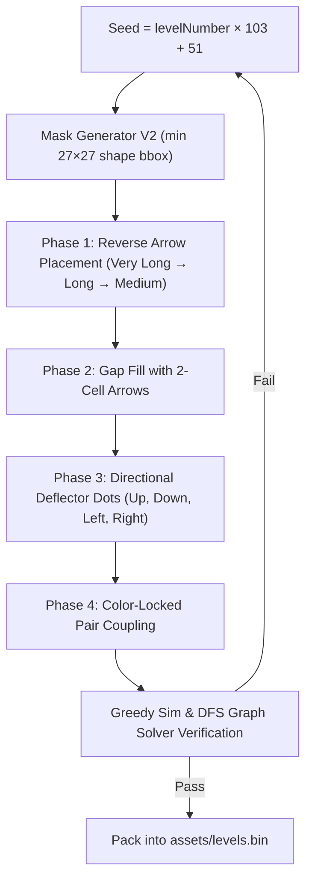

<div align="center">


# Arrow Escape

**A casual grid puzzle game — slide arrows out of the grid. Built with Flutter & Flame.**

  <p>
    <a href="https://github.com/gtxPrime/arrow-escape/stargazers">
      
    </a>
    <a href="https://github.com/gtxPrime/arrow-escape/network/members">
      
    </a>
    <a href="https://github.com/gtxPrime/arrow-escape/issues">
      
    </a>
    <a href="https://github.com/gtxPrime/arrow-escape/blob/main/LICENSE">
      
    </a>
    <a href="#">
      
    </a>
    <a href="https://github.com/gtxPrime/arrow-escape/releases/latest">
      
    </a>
  </p>

  <a href="https://github.com/gtxPrime/arrow-escape/releases/latest">
    
  </a>

</div>

---

## About

Arrow Escape is a grid-based puzzle game where players slide arrows out of the grid. Each level is procedurally generated and deterministic — the same level number always produces the same puzzle on every device. The game ships with **500 pre-generated, 100% verified solvable levels** across 7 difficulty bands, powered by **LevelGeneratorV2** with tutorial, Boss, and God level variants.

---

## Features

| Feature | Description |
|---|---|
| **Slide Mechanics** | Tap an arrow — if its exit path to the canvas edge is clear, it slides out smoothly |
| **500 Pregenerated Levels** | Fully verified, zero-deadlock levels precompiled into `assets/levels.bin` |
| **LevelGeneratorV2** | Reverse-placement generator + DFS graph solver validation |
| **Direction Deflector Dots** | Directional orphan dots (Up, Down, Left, Right, Neutral) that redirect exiting arrows |
| **Color-Paired Arrows** | Matched color arrow pairs that must be cleared together |
| **Clean Vector Arrows** | Border-stroke-free sleek arrow paths styled dynamically per theme |
| **Dense Silhouette Boss/God Shapes** | Large, thick filled silhouettes (27×27 to 40×40 grids) |
| **Fixed Overlay Shadow Edges** | Fixed `AppColors.background` gradient shadow overlays pinned at top & bottom edges |
| **Level Timers** | Timed God levels (Level > 100) and Timed Boss levels (Level > 200) |
| **Pinch-to-Zoom & Pan** | Smooth `InteractiveViewer` with hit-test margin scaling for edge arrows |
| **Lives & Star System** | 3 hearts per level; star ratings based on remaining lives |
| **Dark / Light Palette** | Sage-green earthy palette with full dark/light theme support |

---

## Tech Stack

| Layer | Technology | Version |
|---|---|---|
| Framework | Flutter | SDK >=3.0.0 <4.0.0 |
| Game Engine | Flame | ^1.18.0 |
| Audio | Flame Audio | ^2.10.0 |
| State | Provider | ^6.1.2 |
| Animations | Flutter Animate | ^4.5.0 |
| Storage | Shared Preferences | ^2.3.2 |
| Fonts | Google Fonts (Nunito) | ^6.2.1 |
| Ads | Google Mobile Ads + Unity Ads | ^5.1.0 / ^0.4.0 |

---

## Game Mechanics

### Grid & Level Types

The grid canvas size scales with level number and level type:

| Level Range | Grid Size | Mask Shape / Style |
|---|---|---|
| Tutorial (1–3) | 10 × 10 | Square grid |
| Normal (4–19) | 15 × 15 to 24 × 24 | Long rectangle / square grid |
| Normal (20–500) | 25 × 25 to 35 × 35 | Long rectangle / square grid |
| Boss & God | 27 × 27 to 40 × 40 | Large, dense filled silhouettes (animal, object, geometric) |

After the 3 tutorial levels, every 7 levels follow a repeating cycle:

```
Position:  1    2    3   [4]   5    6   [7]
Type:     Norm Norm Norm BOSS Norm Norm  GOD
```

- **Normal** — Long rectangular or square canvas layout
- **Boss** — Dense filled shape silhouette (34 shape pool), timed for **Level > 200**
- **God** — Complex dense shape silhouette (24 shape pool), timed for **Level > 100**

### Timer Rules & Duration Formulas

Timer challenges add excitement on higher levels without being impossibly hard:

- **God Levels (> 100)**: Active timer with **25s base buffer + 10–14s per arrow**.
- **Boss Levels (> 200)**: Active timer with **30s base buffer + 12–16s per arrow**.

$$\text{Duration}_{\text{Boss}} = 30 + \text{clamp}\!\left(16 - \frac{(l-100)\times 4}{400}, 12, 16\right) \times N_{\text{arrows}}$$

$$\text{Duration}_{\text{God}} = 25 + \text{clamp}\!\left(14 - \frac{(l-200)\times 4}{300}, 10, 14\right) \times N_{\text{arrows}}$$

---

## Level Generator V2

`LevelGeneratorV2` builds levels backwards from a cleared board to guarantee solvability, then runs double verification before accepting a level into `assets/levels.bin`.



### Mask Generator V2 (Boss & God Silhouettes)

- **Boss Pool (34 Shapes)**: Cat, Dog, Frog, Fox, Tiger, Panda, Fish, Butterfly, House, Crown, Saturn, Trapezoid, Parallelogram, Pentagon, Octagon, Gear, Star4, Shield, Castle, and more.
- **God Pool (24 Shapes)**: Heart, Star, Diamond, Hexagon, Blob, Circle, Flower, GiftBox, Shield, Rocket, Sun, Cloud, Gem, Snowflake, TeddyBear, Globe, Cat, Crown, Castle.
- **Dense Fill Requirement**: All Boss & God shapes enforce `w >= 27` and `h >= 27` active bounding box thresholds on grids $\ge 27\times 27$.

### Level Binary Asset (`assets/levels.bin`)

All 500 levels are pre-compiled and shipped in a single **741 KB** binary file:

```
[HEADER]      8 bytes      magic 'LVLB' + version + level count (500)
[INDEX]       500 × 4B     O(1) byte offset per level lookup
[DATA]        gridSize, maskShape, arrows (delta-encoded paths),
              mask bitmask, deflector dots
```

### Mask Shapes

Boss/God levels use shaped silhouettes:

| Category | Shapes |
|---|---|
| Geometric | heart, star, diamond, hexagon, blob, circle |
| Animals | cat, dog, frog, fox, tiger, panda, fish, bird, butterfly |
| Objects | guitar, tree, house, crown, saturn |

---

## Installation

### Prerequisites

- Flutter SDK >= 3.0.0 — [flutter.dev/get-started](https://docs.flutter.dev/get-started/install)
- Run `flutter doctor` to verify setup

### Android APK

```bash
flutter pub get
flutter build apk --release
# Output: build/app/outputs/flutter-apk/app-release.apk

# Smaller split APKs (install arm64-v8a on modern phones)
flutter build apk --split-per-abi --release
```

### Android Studio

1. Install Android Studio + Flutter & Dart plugins
2. **File → Open** → select the project folder
3. Wait for Gradle sync, create an AVD, press **Run**

### iOS (macOS only)

```bash
sudo gem install cocoapods
flutter pub get
cd ios && pod install && cd ..
flutter run
open ios/Runner.xcworkspace   # set signing team, then build
flutter build ios --release
```

### Web

```bash
flutter config --enable-web
flutter pub get
flutter run -d chrome
flutter build web --release   # deploy build/web/ to any static host
```

> [!IMPORTANT]
> Disable ads before web builds: `enableAdMob = false`, `enableUnityAds = false` in `constants.dart`.

### Windows

```bash
flutter config --enable-windows-desktop
flutter pub get
flutter run -d windows
flutter build windows --release
# Output: build\windows\x64\runner\Release\arrow_escape.exe
```

### All Platforms

| Platform | Build Command | Output |
|---|---|---|
| Android APK | `flutter build apk --release` | `build/app/outputs/flutter-apk/app-release.apk` |
| Android AAB | `flutter build appbundle --release` | `build/app/outputs/bundle/release/app-release.aab` |
| iOS | `flutter build ios --release` | `build/ios/iphoneos/Runner.app` |
| Web | `flutter build web --release` | `build/web/` |
| Windows | `flutter build windows --release` | `build/windows/x64/runner/Release/` |

---

## Monetization & Environment Configuration

AdMob SDK with AdMob Mediation support (Unity Ads, AppLovin served server-side).

### Environment Variables (`.env`)

Secrets and Ad Unit IDs are loaded securely from `.env` using `flutter_dotenv`.
Copy `.env.example` to `.env` for local development or production releases:

```env
ADMOB_APP_ID_ANDROID=ca-app-pub-3940256099942544~3347511713
ADMOB_BANNER_ID=ca-app-pub-3940256099942544/6300978111
ADMOB_INTERSTITIAL_ID=ca-app-pub-3940256099942544/1033173712
ADMOB_REWARDED_ID=ca-app-pub-3940256099942544/5224354917
```

> **Note**: `.env` is listed in `.gitignore` so your production keys will never leak to public repositories.

### Android Manifest Setup (`android/app/src/main/AndroidManifest.xml`)

Add your AdMob Application ID to AndroidManifest:
```xml
<meta-data android:name="com.google.android.gms.ads.APPLICATION_ID"
           android:value="ca-app-pub-XXXXXXXXXX~XXXXXXXXXX"/>
```

### Interstitial Frequency

```dart
static const int interstitialEveryNLevels = 4;
```
```

---

> This project is MIT licensed. If you fork or reuse significant portions, please give credit by linking back to this repository.

---

## Star History

<div align="center">
  <a href="https://star-history.com/#gtxPrime/arrow-escape&Date">
    
  </a>
</div>
